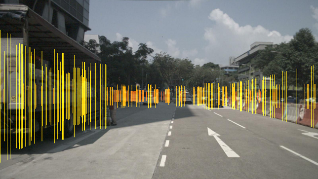

# CRF-Net for Object Detection (Camera and Radar Fusion Network)


This repository provides a neural network for object detection based on camera and radar data. It builds up on the work of [Keras RetinaNet](https://github.com/fizyr/keras-retinanet). 
The network performs a multi-level fusion of the radar and camera data within the neural network.
The network can be tested on the [nuScenes](https://www.nuscenes.org/) dataset, which provides camera and radar data along with 3D ground truth information.

## Requirements
- Linux Ubuntu (tested on versions 16.04 and 18.04)
- CUDA 10.0
- Python 3.5
- Docker 19.03 (only if usage in Docker is desired)
- NVIDIA Container Toolkit (nvidia docker)

## Installation
Install system wide packages:
* `sudo apt install graphviz`

All required python packages can be installed with the crfnet pip package.  We recommend to install the package in its own virtual environment. To install, run the following commands in the repository folder (crfnet).

* `pip install -e .`
* `python setup.py build_ext --inplace`

# CRF-Net Usage
The network uses camera and radar inputs to detect objects. It can be used with the nuScenes dataset and extended to other radar and camera datasets. The nuScenes dataset can be downloaded [here](https://www.nuscenes.org/download).
Pretrained weights are provided [here](https://syncandshare.lrz.de/dl/fi9RrjqLXyLZFuhwjk9KiKjc/crf_net.h5 ) (270MB).
## Start Training
1. Create your desired [configuration](crfnet/configs/README.md) for the CRF-Net. Start by making a copy of the [default_config](crfnet/configs/default.cfg)
2. Execute `python train_crfnet.py`. This will train a model on a given dataset specified in the configs. The result will be stored in [saved_models](crfnet/saved_models) and the logs in [tb_logs](crfnet/tb_logs).
    * `--config <path to your config>` to use your config. Per default the config file found at [./configs/local.cfg](crfnet/configs/local.cfg) is used.

Example usage: 
```bash
python train_crfnet.py --config configs/crf_net.cfg
```

## Evaluate Model
1. Execute `python evaluate_crfnet.py` to calculate the precision and recall values for a model on the data specified 
in the config file. The values and curves are saved onto the hard drive.
    * `--config <path to your config>` show the path of training config.
    * `--model <path to model>` model file saved from prior training
    * `--st <score trehshold>` select a custom threshold at which predictions are considered as positive.
    * `--render` to show images with predicted bounding boxes during execution
    * `--eval_from_detection_pickle` to load saved detection files from the hard drive instead of running the model to 
    evaluate it.
    
Example usage: 
```bash
python evaluate_crfnet.py --model saved_models/crf_net.h5 --config configs/crf_net.cfg --st 0.5
```

## Test Model
1. Execute `python test_crfnet.py` to run a inference model on the data specified in the config file.
    * `--config <path to your config>` show the path of training config.
    * `--model <path to model>` model file saved from prior training
    * `--st <score trehshold>` select a custom threshold at which predictions are considered as positive.
    * `--render` to show images with predicted bounding boxes during execution
    * `--no_radar_visualization` suppresses the radar data in the visualization
    * `--inference` to run the network on all samples (not only the labeled ones, only TUM camra dataset)

Example usage: 
```bash
python test_crfnet.py --model saved_models/crf_net.h5 --config configs/crf_net.cfg --st 0.5
```

## Folder Structure

All main scripts depend on the following subfolders:

1. [configs](crfnet/configs/README.md) folder contains the config files. All the settings for the main scripts are described in this file. A default.cfg (configs/default.cfg) shows an exemplary config file. It is recommended to give each configuration a unique name, as models and tensorboard logs are also named after it.

2. [data_processing](crfnet/data_processing/README.md) folder contains all functions for preprocessing before the neural network. Data fusion functions are placed in this folder. VIsualization of the generated radar augmented image (RAI) is provided by the generator script for the corresponding data set.

3. [model](crfnet/model/README.md) folder contains all the neural network models that can be used. Based on RetinaNet, architectures that fuse camera and radar data at the feature extractor or the FPN are stored here.

4. [utils](crfnet/utils/README.md) utils folder contains helper functions that are needed in many places in this repository. 


## Files
| File | Description |
|----|----|
train_crfnet.py   | Used to train the CRF-Net. 
evaluate_crfnet.py | Used to evaluate a trained CRF-Net model on the validation set.
test_crfnet.py | Used to test a trained CRF-Net model on the test set. This script can be used to record videos.
Dockerfile      | Dockerfile to setup the environment.
requirements.txt | Contains the requirements for the scripts in this repository
setup.py | Installs the requirements for this repository and registers this repository in the python modules

## Usage Docker Image
The use of the docker image is optional. It is tested on a Ubuntu 16.04 host system.

1. Build the docker container via 
 
    `docker build --tag crfnet .`

2. Start the docker using GPU 0 and the container name `crfnet_gpu0` via

    1. Specify dataset dir: `export HOST_DATA_DIR=<HOST_DATA_DIR>`
    2. Specify log dir: `export HOST_LOG_DIR=<HOST_LOG_DIR>`
    3. Specify saved models dir: `export HOST_MODEL_DIR=<HOST_MODEL_DIR>`
    5. Start container: `docker run -it --net=host --gpus '"device=0"' -e USERID=$UID -v $HOST_DATA_DIR:/data/nuscenes -v $HOST_LOG_DIR:/CRFN/crfnet/tb_logs -v $HOST_MODEL_DIR:/CRFN/crfnet/saved_models -e DISPLAY=$DISPLAY --name crfnet_gpu0 crfnet`
 

3. The repository is located at `/CRFN/crfnet` inside the docker and already installed when building the docker. Inside the docker, you start the training with python3 and specify your config file as usual: `python3 train_crfnet.py --config configs/crf_net.cfg`
Additionally you can connect to it via `docker attach crfnet_gpu0`

# Contributions
[1] M. Geisslinger, "Autonomous Driving: "Object Detection using Neural Networks for Radar and Camera Sensor Fusion," Master's Thesis, Technical University of Munich, 2019

[2] M. Weber, "Autonomous Driving: Radar Sensor Noise Filtering and Multimodal Sensor Fusion for Object Detection with Artificial Neural Networks," Master’s Thesis, Technical University of Munich, 2019.

If you find our work useful in your research, please consider citing:

    @INPROCEEDINGS{nobis19crfnet,
        author={Nobis, Felix and Geisslinger, Maximilian and Weber, Markus and Betz, Johannes and Lienkamp, Markus},
        title={A Deep Learning-based Radar and Camera Sensor Fusion Architecture for Object Detection},
        booktitle={2019 Sensor Data Fusion: Trends, Solutions, Applications (SDF)},
        year={2019},
        doi={10.1109/SDF.2019.8916629},
        ISSN={2333-7427}
    }
