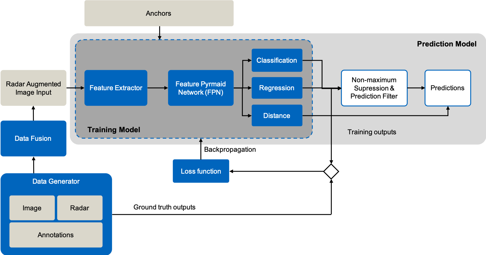

# CRF-Net Model
This folder contains the neural network model which is built up on RetinaNet. A high-level overview of the detection framework is given by the figure below. The prediction model consists of a training model with trainable parameters and adds a non-maximum supression. The loss functions to optimize the training model are also described in this folder. Fusion and data generation is described in the data subfolder.

A more detailed with into the proposed fusion architecture is given by the figure below. The radar data is fused with the image data over the whole feature extractor and Feature Pyramid Network. This setting can be used with vggmax-fpn as network in the configuration. Distance detection as submodule besides regression and classification is an additional feature braught by this work.

